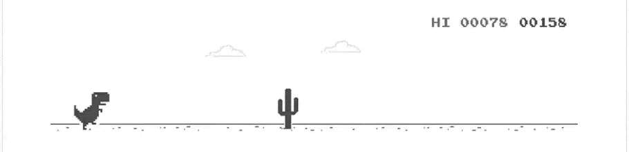

## Hello there, I'm Kason 👨🏽‍💻

I’m a Computer Science student at Brigham Young University committed to creating software that delivers practical results. I've built an exoplanet atmosphere analyzer, the Library Ace web platform, and analytical projects, including research on networks of power and poverty, showcasing a blend of technical skill and ingenuity. I am skilled in full-stack development, software architecture, and developing functional, user-focused systems. Eager to leverage my creativity and coding expertise to design and implement high-quality software!

<!--  -->
